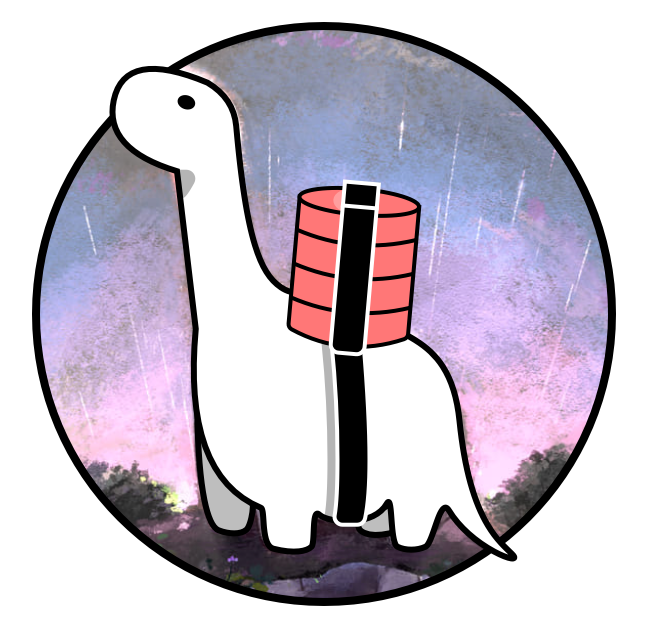

# DenoDB

- 🗣Supports PostgreSQL, MySQL, MariaDB, SQLite and MongoDB
- 🔥Simple, typed API
- 🦕Deno-ready
- [Read the documentation](https://eveningkid.github.io/denodb-docs)

```typescript
import { DataTypes, Database, Model, PostgresConnector } from 'https://deno.land/x/denodb/mod.ts';

const connection = new PostgresConnector({
  host: '...',
  username: 'user',
  password: 'password',
  database: 'airlines',
});

const db = new Database(connection);

class Flight extends Model {
  static table = 'flights';
  static timestamps = true;

  static fields = {
    id: { primaryKey: true, autoIncrement: true },
    departure: DataTypes.STRING,
    destination: DataTypes.STRING,
    flightDuration: DataTypes.FLOAT,
  };

  static defaults = {
    flightDuration: 2.5,
  };
}

db.link([Flight]);

await db.sync({ drop: true });

await Flight.create({
  departure: 'Paris',
  destination: 'Tokyo',
});

// or

const flight = new Flight();
flight.departure = 'London';
flight.destination = 'San Francisco';
await flight.save();

await Flight.select('destination').all();
// [ { destination: "Tokyo" }, { destination: "San Francisco" } ]

await Flight.where('destination', 'Tokyo').delete();

const sfFlight = await Flight.select('destination').find(2);
// { destination: "San Francisco" }

await Flight.count();
// 1

await Flight.select('id', 'destination').orderBy('id').get();
// [ { id: "2", destination: "San Francisco" } ]

await sfFlight.delete();

await db.close();
```

## First steps

Setting up your database with DenoDB is a four-step process:

- **Create a database**, using `Database` (learn more [about clients](#clients)):
  ```typescript
  const connection = new PostgresConnector({
    host: '...',
    username: 'user',
    password: 'password',
    database: 'airlines',
  });

  const db = new Database(connection);
  ```
- **Create models**, extending `Model`. `table` and `fields` are both required static attributes:

  ```typescript
  class User extends Model {
    static table = 'users';

    static timestamps = true;

    static fields = {
      id: {
        primaryKey: true,
        autoIncrement: true,
      },
      name: DataTypes.STRING,
      email: {
        type: DataTypes.STRING,
        unique: true,
        allowNull: false,
        length: 50,
      },
    };
  }
  ```

- **Link your models**, to add them to your database instance:
  ```typescript
  db.link([User]);
  ```
- Optional: **Create tables in your database**, by using `sync(...)`:
  ```typescript
  await db.sync();
  ```
- **Query your models!**
  ```typescript
  await User.create({ name: 'Amelia' });
  await User.all();
  await User.deleteById('1');
  ```

## Migrate from previous versions
- `v1.0.21`: [Migrate to connectors](docs/v1.0.21-migrations/connectors.md)

## License

MIT License — [eveningkid](https://github.com/eveningkid)
